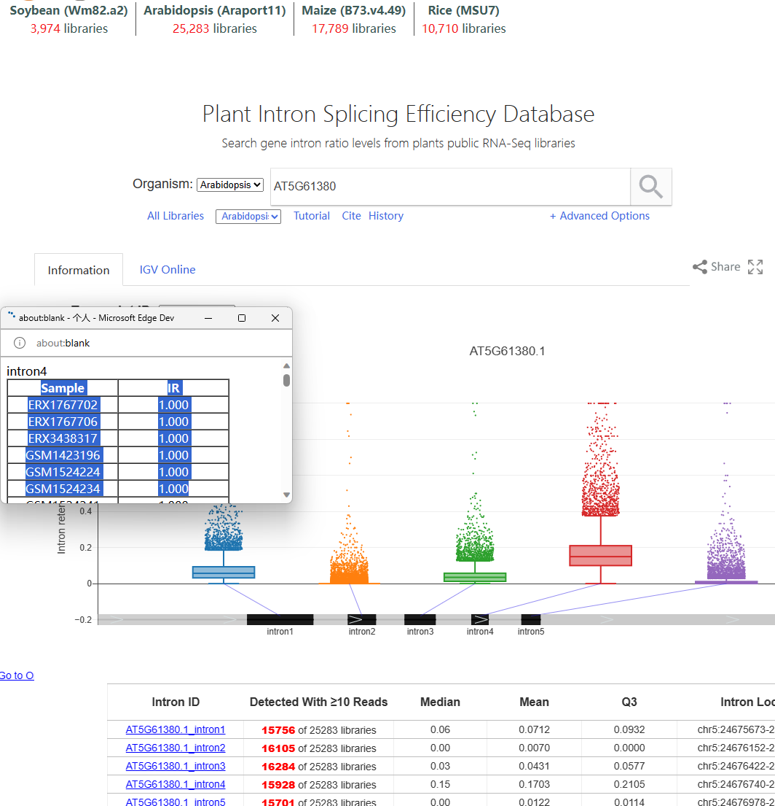
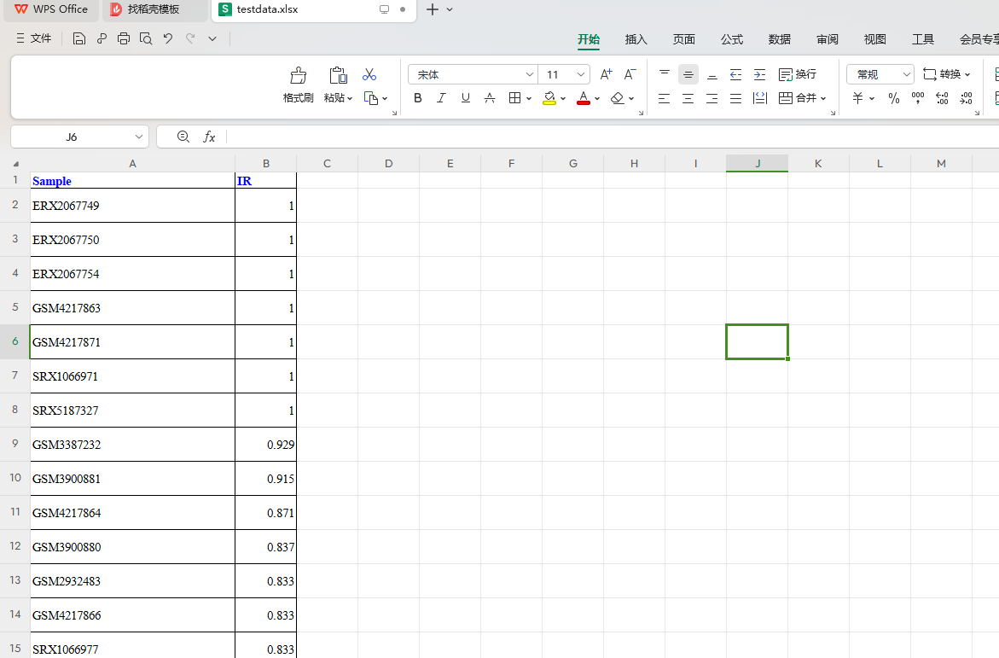
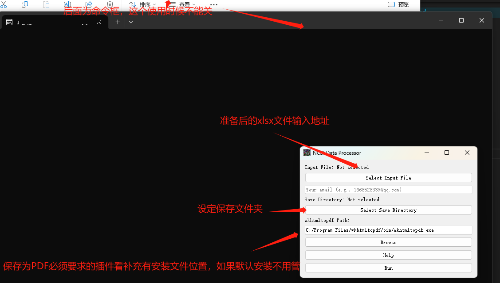
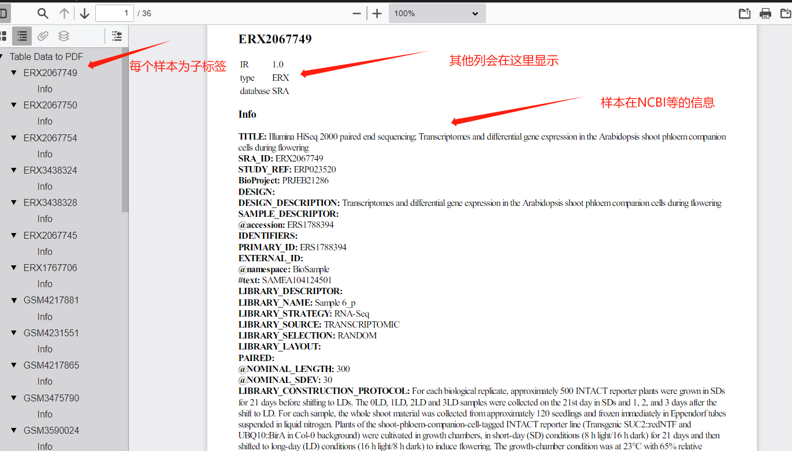
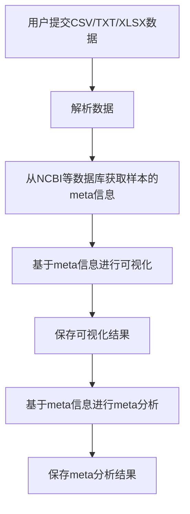

**测序样本数据处理与可视化系统**
使用要求 安装 wkhtmltox文件
在github下我的目录下提供了wkhtmltox-0.12.6-1.msvc2015-win64.exe 的安装包

### 使用说明
exe 文件

以https://plantintron.com/ 为例子其中我们复制这个表格里面数据

粘贴到一个xlsx或者csv文件中即可

或者自己创建一个文件只要注意就是第一列列名必须为Sample即可.

准备好之后点击EXE文件执行即可

关于执行结束后会出现指定弹窗(由于NCBI时间限制，爬取时间不超过1秒三个)

结果解读在你指定目录下会返回一个result.pdf文件

**1. 数据输入：**

- 用户可以提交CSV、TXT、XLSX格式的数据。
- 数据应包含至少两列：样本ID列和样本的特征列。
- 系统应能够自动识别并解析这些格式的数据。

**2. 数据处理：**

- 系统将自动从NCBI等数据库获取与提交的样本ID相关的meta信息。
- 系统应能够处理大量的样本数据，并确保数据的准确性和完整性。

**3. 数据可视化：**

- 基于获取的meta信息，系统将为用户提供可视化的结果。
- 可视化结果应该是直观的，能够清晰地展示样本的特征和meta信息。
- 用户应能够选择不同的可视化方式，例如柱状图、饼图、散点图等。

**4. 数据保存：**

- 用户可以选择保存可视化结果为图片或PDF格式。
- 系统还应提供一个功能，允许用户保存原始的meta信息和处理后的数据。

**5. Meta分析：**

- 系统将基于获取的meta信息和用户提交的样本特征进行meta分析。
- 分析结果应该是详细的，并提供统计数据和相关的解释。
- 用户应能够下载分析结果。

**6. 系统安全性：**

- 所有用户提交的数据和获取的meta信息应该被安全地存储，并确保不被未经授权的访问。
- 系统应该定期备份数据，以防数据丢失。

**7. 用户支持：**

- 系统应提供一个用户手册或在线帮助，指导用户如何使用系统。
- 如果用户遇到问题，应该有一个技术支持团队可以提供帮助。

开发方案准备

​	1 基于pyqt5

​	2 基于python实现

​	3 数据和记录存储

计划表

---

**测序样本数据处理与可视化系统测试计划**

- [x] **1. 数据输入模块测试**
    - [x] 1.1 测试CSV格式数据输入
    - [x] 1.2 测试TXT格式数据输入
    - [x] 1.3 测试XLSX格式数据输入
    - [x] 1.4 测试数据解析功能
    - [x] 1.5 测试错误数据的提示与处理

- [x] **2. 数据处理模块测试**
    - [x] 2.1 测试NCBI数据库连接与查询
    - [x] 2.2 测试数据完整性检查
    - [x] 2.3 测试数据匹配与整合

- [ ] **3. 数据可视化模块测试**
    - [ ] 3.1 测试柱状图可视化
    - [ ] 3.2 测试饼图可视化
    - [ ] 3.3 测试散点图可视化
    - [ ] 3.4 测试可视化参数设置

- [x] **4. 数据保存模块测试**
    - [x] 4.1 测试图片保存功能
    - [x] 4.2 测试PDF保存功能
    - [x] 4.3 测试原始数据与处理数据保存

- [ ] **5. Meta分析模块测试**
    - [ ] 5.1 测试分析算法
    - [ ] 5.2 测试分析参数设置
    - [ ] 5.3 测试分析结果展示
    - [ ] 5.4 测试分析结果下载

- [ ] **6. 基于pyqt5发布win软件版本**
    - [ ] 6.1 框架设计
    - [ ] 6.2 测试
    - [ ] 6.3 发布软件以及软件所需要支持注意细节

- [ ] **7. 用户支持模块测试**
    - [ ] 7.1 测试用户手册的准确性与完整性
    - [ ] 7.2 测试在线帮助功能
    - [ ] 7.3 测试技术支持响应时间

---

