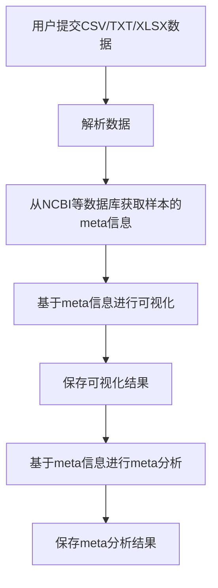

**测序样本数据处理与可视化系统**

**1. 数据输入：**

- 用户可以提交CSV、TXT、XLSX格式的数据。
- 数据应包含至少两列：样本ID列和样本的特征列。
- 系统应能够自动识别并解析这些格式的数据。

**2. 数据处理：**

- 系统将自动从NCBI等数据库获取与提交的样本ID相关的meta信息。
- 系统应能够处理大量的样本数据，并确保数据的准确性和完整性。

**3. 数据可视化：**

- 基于获取的meta信息，系统将为用户提供可视化的结果。
- 可视化结果应该是直观的，能够清晰地展示样本的特征和meta信息。
- 用户应能够选择不同的可视化方式，例如柱状图、饼图、散点图等。

**4. 数据保存：**

- 用户可以选择保存可视化结果为图片或PDF格式。
- 系统还应提供一个功能，允许用户保存原始的meta信息和处理后的数据。

**5. Meta分析：**

- 系统将基于获取的meta信息和用户提交的样本特征进行meta分析。
- 分析结果应该是详细的，并提供统计数据和相关的解释。
- 用户应能够下载分析结果。

**6. 系统安全性：**

- 所有用户提交的数据和获取的meta信息应该被安全地存储，并确保不被未经授权的访问。
- 系统应该定期备份数据，以防数据丢失。

**7. 用户支持：**

- 系统应提供一个用户手册或在线帮助，指导用户如何使用系统。
- 如果用户遇到问题，应该有一个技术支持团队可以提供帮助。





开发方案准备

​	1 基于pyqt5

​	2 基于python实现

​	3 数据和记录存储


计划表

---

**测序样本数据处理与可视化系统测试计划**

- [ ] **1. 数据输入模块测试**
    - [ ] 1.1 测试CSV格式数据输入
    - [ ] 1.2 测试TXT格式数据输入
    - [ ] 1.3 测试XLSX格式数据输入
    - [ ] 1.4 测试数据解析功能
    - [ ] 1.5 测试错误数据的提示与处理

- [ ] **2. 数据处理模块测试**
    - [ ] 2.1 测试NCBI数据库连接与查询
    - [ ] 2.2 测试数据完整性检查
    - [ ] 2.3 测试数据匹配与整合

- [ ] **3. 数据可视化模块测试**
    - [ ] 3.1 测试柱状图可视化
    - [ ] 3.2 测试饼图可视化
    - [ ] 3.3 测试散点图可视化
    - [ ] 3.4 测试可视化参数设置

- [ ] **4. 数据保存模块测试**
    - [ ] 4.1 测试图片保存功能
    - [ ] 4.2 测试PDF保存功能
    - [ ] 4.3 测试原始数据与处理数据保存

- [ ] **5. Meta分析模块测试**
    - [ ] 5.1 测试分析算法
    - [ ] 5.2 测试分析参数设置
    - [ ] 5.3 测试分析结果展示
    - [ ] 5.4 测试分析结果下载

- [ ] **6. 系统安全性测试**
    - [ ] 6.1 测试数据加密与存储
    - [ ] 6.2 测试访问控制
    - [ ] 6.3 测试数据备份与恢复

- [ ] **7. 用户支持模块测试**
    - [ ] 7.1 测试用户手册的准确性与完整性
    - [ ] 7.2 测试在线帮助功能
    - [ ] 7.3 测试技术支持响应时间

---


Biosample

Plant sample 主要用于收录 Sample Type 为 Plant sample 的植物样本或植物细胞系数据。 词条名称 描述 备注 *Sample name 请提供一个意义明确、简短且唯一 样本名称 *Organism 需要填写组织来源的生物/物种学 名，即拉丁名称 可使用NCBI的Taxonomy数据库进行搜 索和验证 *Cultivar 品种名称，主要用于驯养的动物或 植物 *Biomaterial provider 实验样本提供者信息，可以是单位 名称，也可以是 PI 名字 *Tissue 提供样本的来源组织/器官信息 Age 样本取样时的苗期/时期信息 Cell line 细胞系名称 Cell type 细胞类型 Collected by 取样人员或机构名称 Collection date 取样时间 格式" yyyy-MM-dd " Culture collection 原始样本的储存机构 Development stage 样本的生长发育阶段 9 词条名称 描述 备注 Disease 患病情况 Disease stage 疾病分期 Genotype 基因型 Growth protocol 培养方式或方法 Height or length 样本的高度/尺寸 Isolation source 描述分离提取生物样本的物理、环 境和/或地理分布信息 Latitude and longitude 取样地点的地理坐标 指经纬度信息，例如：38.98 N 77.11 W Phenotype 样本表型信息 Population 用于描述对于植物子代，子代数等 遗传结构 Type 样本类型 如细胞培养、混合培养，组织样本，整个 生物，单细胞或其他 Sex 样本的性别 Specimen voucher 样本标识符 Temperature 取样时环境温度 Treatment 样本处理方


样本编号来源解读

array(['DRX', 'ERX', 'GSM', 'SRX'], dtype=object)

1. **DRX** - 这是DDBJ（DNA Data Bank of Japan）的运行编号前缀。DDBJ是GenBank、EMBL和DDBJ三个主要的核酸序列数据库之一。
2. **ERX** - 这是ENA（European Nucleotide Archive）的运行编号前缀。ENA是欧洲的核酸序列数据库，与GenBank和DDBJ相似。
3. **GSM** - 这是GEO（Gene Expression Omnibus）的样本编号前缀。GEO是由NCBI维护的一个公共基因表达数据库。
4. **SRX** - 这是SRA（Sequence Read Archive）的实验编号前缀。SRA是由NCBI维护的一个公共的高通量测序数据存储库。


利用Bio 的 Entrez 模块 

`Bio.Entrez` 模块利用了Entrez Programming Utilities（也称作EUtils），包含八个工具，详情请见NCBI的网站： http://www.ncbi.nlm.nih.gov/entrez/utils/. 每个工具都能在Python的 `Bio.Entrez` 模块中找到对应函数，后面会详细讲到。这个模块可以保证用来查询的URL 的正确性，并且向NCBI要求的一样，**每三秒钟查询的次数不超过一。**


**2返回结果解析**

EUtils返回的输出结果通常是XML格式，我们有以下不同的方法来解析这种类型的输入文件：

1. 使用 `Bio.Entrez`解析器将XML输出的解析成Python对象;
2. 使用Python标准库中的DOM (Document Object Model)解析器;
3. 使用Python标准库中的SAX (Simple API for XML)解析器;
4. 把XML输出当做原始的文本文件，通过字符串查找和处理来进行解析；

对于DOM和SAX解析器，可以查看Python的文档. `Bio.Entrez` 中使用到的解析器将会在下面讨论.

NCBI使用**DTD (Document Type Definition)文件来描述XML文件中所包含信息的结构**. 大多数NCBI使用的DTD文件 格式都包含在了Biopython发行包里。当NCBI Entrez读入一个XML格式的文件的时候，`Bio.Entrez` 将会使用DTD文件。

有时候，你可能会发现与某种特殊的XML相关的DTD文件在Biopython发行包里面不存在。当NCBI升级它的 DTD文件的时候，这种情况可能发生。如果发生这种情况，`Entrez.read` 将会显示丢失的DTD文件名字和URL的 警示信息。解析器会通过互联网获取缺失的DTD文件，让XML的分析继续正常进行。如果本地存在对应的DTD文件的 话，处理起来会更快。因此，为了更快的处理，我们可以通过警示信息里面的URL来下载对应的DTD文件，将文件放在DTD 文件默认存放的文件夹 `...site-packages/Bio/Entrez/DTDs` 。如果你没有权限进入这个文件夹，你也可以把 DTD文件放到 `~/.biopython/Bio/Entrez/DTDs` 这个目录，`~` 表示的是你的Home目录。因为这个目录会先于 `...site-packages/Bio/Entrez/DTDs` 被解析器读取，所以当 `...site-packages/Bio/Entrez/DTDs` 下面的DTD文件过时的时候，你也可以将最新版本的DTD文件放到Home目录的那个文件夹下面。当然也有其他方案，如果你 是通过源码来安装的Biopython，你可以将DTD文件放到源码的 `Bio/Entrez/DTDs` 文件夹下，然后重新安装Biopython。 这样会将新的DTD文件和之前的一样地安装到正确的位置。

==Entrez.read可以用于读取XML或者说返回结果解析未字典==

设置全局email 用于提醒，关于request频次 不能一秒超过三次，不过如果用biopython的话不用注意这些，其自动会帮我们限制。

```
 Entrez.email = "A.N.Other@example.com"
```


如果在一个软件中使用该工具需要详细说明下**Entrez.tool**

```python
Entrez.tool = "MyLocalScript"
```

- 对于大规模的查询请求，NCBI也推荐使用他们的会话历史特性**（ WebEnv会话cookie字符串，见 章节 [9.15](https://biopython-cn.readthedocs.io/zh-cn/latest/cn/chr09.html#sec-entrez-webenv) ）**。 只是这个稍微有点复杂。


### Entrez组件中功能和说明

#### EInfo: 获取Entrez数据库的信息

获取整个数据库信息，获取指定字库的全面的信息。

1 未指定字库可以通过该命令查询NCBI中所有子库有哪些

```python
handle = Entrez.einfo()
```

2 查询指定子库(每个字库可以看成是一个大表，可以利用返回结果查询子库中存在哪些字段名)

```python
handle = Entrez.einfo(db="pubmed")
record = Entrez.read(handle)
record["DbInfo"]#下会存着关于该数据库描述信息
# 如record["DbInfo"]["Description"]，record["DbInfo"]["Count"]，record["DbInfo"]["LastUpdate"]以及ecord["DbInfo"]["FieldList"]。描述，记录数目统计，更新信息，以及字库表有哪些字段

```

####  2 ESearch: 搜索Entrez数据库

我们可以使用 `Bio.Entrez.esearch()` 来搜索任意的数据库。例如，我们在PubMed中搜索跟Biopython相关的文献：

```python
from Bio import Entrez
Entrez.email = "A.N.Other@example.com"     # Always tell NCBI who you are
handle = Entrez.esearch(db="pubmed", term="biopython")
record = Entrez.read(handle)
record["IdList"]
['19304878', '18606172', '16403221', '16377612', '14871861', '14630660', '12230038']
```

在输出的结果中，我们可以看到七个PubMed IDs（包括19304878，这个是Biopython应用笔记的PMID），你可以通过== EFetch==来获取这些文献.

你也可以通过ESearch来搜索GenBank。我们将以在*Cypripedioideae* orchids中搜索*matK*基因为例，快速展示 一下（请见章节 [9.2](https://biopython-cn.readthedocs.io/zh-cn/latest/cn/chr09.html#sec-entrez-einfo) 关于EInfo：一种查明你可以在哪个Entrez数据库中搜索的方法）。

**term="Cypripedioideae[Orgn] AND matK[Gene]"**高级搜索 物种最好用taxon ID

```python
handle = Entrez.esearch(db="nucleotide",term="Cypripedioideae[Orgn] AND matK[Gene]")
record = Entrez.read(handle)
record["Count"]
'25'
record["IdList"]
['126789333', '37222967', '37222966', '37222965', ..., '61585492']
```

每个IDs(126789333, 37222967, 37222966, …)是GenBank的一个标识。请见章节 [9.6](https://biopython-cn.readthedocs.io/zh-cn/latest/cn/chr09.html#sec-efetch) 此章包含了怎样下载这些GenBank的记录的信息。

注意，不是像 `Cypripedioideae[Orgn]` 这样在搜索的时候加上特定的物种名字，而是需要在搜索的时候使用NCBI的 taxon ID，像 `txid158330[Orgn]` 这样。这个并没有记录在ESearch的帮助页面上，NCBI通过邮件回复解释了这个 问题。你可以通过经常和Entrez的网站接口互动，来推断搜索条目的格式。例如，在基因组搜索的时候加上 `complete[prop]` 可以把结果限制在完成的基因组上。

作为最后一个例子，让我们获取一个computational journal名字的列表：

```python
handle = Entrez.esearch(db="journals", term="computational")
record = Entrez.read(handle)
record["Count"]
'16'
record["IdList"]
['30367', '33843', '33823', '32989', '33190', '33009', '31986',
 '34502', '8799', '22857', '32675', '20258', '33859', '32534',
 '32357', '32249']
```

同样，我们可以通过EFetch来获得关于每个journal IDs更多的消息。

EFetch 补充信息链接

[The E-utilities In-Depth: Parameters, Syntax and More - Entrez Programming Utilities Help - NCBI Bookshelf (nih.gov)](https://www.ncbi.nlm.nih.gov/books/NBK25499/#chapter4.ESearch)


#### 3 EPostt: 上传identifiers的列表

EPost上传在后续搜索中将会用到的IDs的列表，参见 [EPost 帮助页面](http://www.ncbi.nlm.nih.gov/entrez/query/static/epost_help.html) 来获取更多信息. 通过 `Bio.Entrez.epost()` 函数可以在Biopython中实现。

为了举一个关于此用法的例子，假设你有一个想通过EFetch下载的IDs的长长的列表（可能是序列，也有可能是引用的 其他内容）。当你通过EFetch发出下载请求的时候，你的IDs列表、数据库等，将会被转变成一个长的URL，然后被发送 到服务器。如果IDs列表很长，URL也会很长，长的URL可能会断掉（比如，一些代理不能复制全部的内容）。

另外，你也可以把以上分成两步来完成，首先用EPost来上传IDs的列表（这个使用了一个内部的 “HTML post” ，而不是 “HTML get” ， 避开了long URL可能产生的问题）。由于历史记录的支持，你可以使用EFetch来指向这个长的IDs列表， 并且下载相关的数据。

让我们通过下面一个简单的例子来看看EPost是如何工作的——上传了一些PubMed的IDs：

```python
from Bio import Entrez
Entrez.email = "A.N.Other@example.com"     # Always tell NCBI who you are
id_list = ["19304878", "18606172", "16403221", "16377612", "14871861", "14630660"]
print Entrez.epost("pubmed", id=",".join(id_list)).read()
# IDlist提交后就返回了该id_list的记录ID信息有QueryKey和WebEnv组成


<?xml version="1.0"?>
<!DOCTYPE ePostResult PUBLIC "-//NLM//DTD ePostResult, 11 May 2002//EN"
 "http://www.ncbi.nlm.nih.gov/entrez/query/DTD/ePost_020511.dtd">
<ePostResult>
 <QueryKey>1</QueryKey>
 <WebEnv>NCID_01_206841095_130.14.22.101_9001_1242061629</WebEnv>
</ePostResult>
```

返回的XML包含了两个重要的字符串， `QueryKey` 和 `WebEnv` ，两个字符串一起确定了之前的历史记录。你可以 使用其他的Entrez工具，例如EFetch，来提取这些值：

```python
from Bio import Entrez
Entrez.email = "A.N.Other@example.com"     # Always tell NCBI who you are
id_list = ["19304878", "18606172", "16403221", "16377612", "14871861", "14630660"]
search_results = Entrez.read(Entrez.epost("pubmed", id=",".join(id_list)))
webenv = search_results["WebEnv"]
query_key = search_results["QueryKey"]
```

第 [9.15](https://biopython-cn.readthedocs.io/zh-cn/latest/cn/chr09.html#sec-entrez-webenv) 章节讲述了如何使用历史的特性。

利用历史(因为你使用Entrez.search()或操作后都会返回一个IDlist，我们可以利用前一个提交的返回的list的记录ID实现全面的检索)批量获取数据更方便的意思吧，相当于查询的结果在NCBI上有记录这个记录的ID由WebENV和QueryKey组成，因为返回的就是IDlist这个就是关键信息所以要获取

#### 4 ESummary: 通过主要的IDs来获取摘要

ESummary可以通过一个primary IDs来获取文章的摘要（参见 [ESummary 帮助页面](http://www.ncbi.nlm.nih.gov/entrez/query/static/esummary_help.html) 来获取更多信息）。在Biopython中，ESummary以 `Bio.Entrez.esummary()` 的形式出现。根据上面的搜索结果， 我们可以获得ID为30367杂志相关的更多信息：

```python
from Bio import Entrez
Entrez.email = "A.N.Other@example.com"     # Always tell NCBI who you are
handle = Entrez.esummary(db="journals", id="30367")
record = Entrez.read(handle)
record[0]["Id"]
'30367'
record[0]["Title"]
'Computational biology and chemistry'
record[0]["Publisher"]
'Pergamon,'
```

#### 5EFetch: 从Entrez下载更多的记录

==BioSEQ==读取fasta数据

当你想要从Entrez中提取完整的记录的时候，你可以使用EFetch。 在 [EFetch的帮助页面](http://eutils.ncbi.nlm.nih.gov/entrez/query/static/efetch_help.html) 可以查到EFetch可以起作用的数据库。

NCBI大部分的数据库都支持多种不同的文件格式。当使用 `Bio.Entrez.efetch()` 从Entrez下载特定的某种格式的时候， 需要 `rettype` 和或者 `retmode` 这些可选的参数。对于不同数据库类型不同的搭配在下面的网页中有描述： [NCBI efetch webpage](http://www.ncbi.nlm.nih.gov/entrez/query/static/efetch_help.html) (例如： [literature](http://eutils.ncbi.nlm.nih.gov/corehtml/query/static/efetchlit_help.html), [sequences](http://eutils.ncbi.nlm.nih.gov/corehtml/query/static/efetchseq_help.html) and [taxonomy](http://eutils.ncbi.nlm.nih.gov/corehtml/query/static/efetchtax_help.html)). <span style="color:red">其实数据格式有哪些可以去找一个示例数据去网页里面进行相关的查找，这个可能还是会不一样的的可以去上面链接网站去找下不过好像要更新了</span>

一种常用的用法是下载FASTA或者GenBank/GenPept的文本格式 (接着可以使用 `Bio.SeqIO` 来解析, 参见 [5.3.1](https://biopython-cn.readthedocs.io/zh-cn/latest/cn/chr05.html#sec-seqio-genbank-online) 和 [9.6](https://biopython-cn.readthedocs.io/zh-cn/latest/cn/chr09.html#sec-efetch) ）。从上面 *Cypripedioideae* 的例子,我们可以通过 `Bio.Entrez.efetch` 从GenBank下载记录186972394。

```
>>> from Bio import Entrez
>>> Entrez.email = "A.N.Other@example.com"     # Always tell NCBI who you are
>>> handle = Entrez.efetch(db="nucleotide", id="186972394", rettype="gb", retmode="text")
>>> print handle.read()
LOCUS       EU490707                1302 bp    DNA     linear   PLN 05-MAY-2008
DEFINITION  Selenipedium aequinoctiale maturase K (matK) gene, partial cds;
            chloroplast.
ACCESSION   EU490707
VERSION     EU490707.1  GI:186972394
KEYWORDS    .
SOURCE      chloroplast Selenipedium aequinoctiale
  ORGANISM  Selenipedium aequinoctiale
            Eukaryota; Viridiplantae; Streptophyta; Embryophyta; Tracheophyta;
            Spermatophyta; Magnoliophyta; Liliopsida; Asparagales; Orchidaceae;
            Cypripedioideae; Selenipedium.
REFERENCE   1  (bases 1 to 1302)
  AUTHORS   Neubig,K.M., Whitten,W.M., Carlsward,B.S., Blanco,M.A.,
            Endara,C.L., Williams,N.H. and Moore,M.J.
  TITLE     Phylogenetic utility of ycf1 in orchids
  JOURNAL   Unpublished
REFERENCE   2  (bases 1 to 1302)
  AUTHORS   Neubig,K.M., Whitten,W.M., Carlsward,B.S., Blanco,M.A.,
            Endara,C.L., Williams,N.H. and Moore,M.J.
  TITLE     Direct Submission
  JOURNAL   Submitted (14-FEB-2008) Department of Botany, University of
            Florida, 220 Bartram Hall, Gainesville, FL 32611-8526, USA
FEATURES             Location/Qualifiers
     source          1..1302
                     /organism="Selenipedium aequinoctiale"
                     /organelle="plastid:chloroplast"
                     /mol_type="genomic DNA"
                     /specimen_voucher="FLAS:Blanco 2475"
                     /db_xref="taxon:256374"
     gene            <1..>1302
                     /gene="matK"
     CDS             <1..>1302
                     /gene="matK"
                     /codon_start=1
                     /transl_table=11
                     /product="maturase K"
                     /protein_id="ACC99456.1"
                     /db_xref="GI:186972395"
                     /translation="IFYEPVEIFGYDNKSSLVLVKRLITRMYQQNFLISSVNDSNQKG
                     FWGHKHFFSSHFSSQMVSEGFGVILEIPFSSQLVSSLEEKKIPKYQNLRSIHSIFPFL
                     EDKFLHLNYVSDLLIPHPIHLEILVQILQCRIKDVPSLHLLRLLFHEYHNLNSLITSK
                     KFIYAFSKRKKRFLWLLYNSYVYECEYLFQFLRKQSSYLRSTSSGVFLERTHLYVKIE
                     HLLVVCCNSFQRILCFLKDPFMHYVRYQGKAILASKGTLILMKKWKFHLVNFWQSYFH
                     FWSQPYRIHIKQLSNYSFSFLGYFSSVLENHLVVRNQMLENSFIINLLTKKFDTIAPV
                     ISLIGSLSKAQFCTVLGHPISKPIWTDFSDSDILDRFCRICRNLCRYHSGSSKKQVLY
                     RIKYILRLSCARTLARKHKSTVRTFMRRLGSGLLEEFFMEEE"
ORIGIN
        1 attttttacg aacctgtgga aatttttggt tatgacaata aatctagttt agtacttgtg
       61 aaacgtttaa ttactcgaat gtatcaacag aattttttga tttcttcggt taatgattct
      121 aaccaaaaag gattttgggg gcacaagcat tttttttctt ctcatttttc ttctcaaatg
      181 gtatcagaag gttttggagt cattctggaa attccattct cgtcgcaatt agtatcttct
      241 cttgaagaaa aaaaaatacc aaaatatcag aatttacgat ctattcattc aatatttccc
      301 tttttagaag acaaattttt acatttgaat tatgtgtcag atctactaat accccatccc
      361 atccatctgg aaatcttggt tcaaatcctt caatgccgga tcaaggatgt tccttctttg
      421 catttattgc gattgctttt ccacgaatat cataatttga atagtctcat tacttcaaag
      481 aaattcattt acgccttttc aaaaagaaag aaaagattcc tttggttact atataattct
      541 tatgtatatg aatgcgaata tctattccag tttcttcgta aacagtcttc ttatttacga
      601 tcaacatctt ctggagtctt tcttgagcga acacatttat atgtaaaaat agaacatctt
      661 ctagtagtgt gttgtaattc ttttcagagg atcctatgct ttctcaagga tcctttcatg
      721 cattatgttc gatatcaagg aaaagcaatt ctggcttcaa agggaactct tattctgatg
      781 aagaaatgga aatttcatct tgtgaatttt tggcaatctt attttcactt ttggtctcaa
      841 ccgtatagga ttcatataaa gcaattatcc aactattcct tctcttttct ggggtatttt
      901 tcaagtgtac tagaaaatca tttggtagta agaaatcaaa tgctagagaa ttcatttata
      961 ataaatcttc tgactaagaa attcgatacc atagccccag ttatttctct tattggatca
     1021 ttgtcgaaag ctcaattttg tactgtattg ggtcatccta ttagtaaacc gatctggacc
     1081 gatttctcgg attctgatat tcttgatcga ttttgccgga tatgtagaaa tctttgtcgt
     1141 tatcacagcg gatcctcaaa aaaacaggtt ttgtatcgta taaaatatat acttcgactt
     1201 tcgtgtgcta gaactttggc acggaaacat aaaagtacag tacgcacttt tatgcgaaga
     1261 ttaggttcgg gattattaga agaattcttt atggaagaag aa
//
```

参数 `rettype="gb"` 和 `retmode="text"` 让我们下载的数据为GenBank格式。

需要注意的是直到2009年，Entrez EFetch API要求使用 “genbank” 作为返回类型，然而现在NCBI坚持使用官方的 “gb” 或 “gbwithparts” （或者针对蛋白的“gp”) 返回类型。同样需要注意的是，直到2012年2月， Entrez EFetch API默认的返回格式为纯文本格式文件，现在默认的为XML格式。

作为另外的选择，你也可以使用 `rettype="fasta"` 来获取Fasta格式的文件；参见 [EFetch Sequences 帮助页面](http://www.ncbi.nlm.nih.gov/entrez/query/static/efetchseq_help.html) 。 记住，可选的数据格式决定于你要下载的数据库——请参见 [EFetch 帮助页面](http://eutils.ncbi.nlm.nih.gov/entrez/query/static/efetch_help.html).

如果你要获取记录的格式是 `Bio.SeqIO` 所接受的一种格式(见第 [5](https://biopython-cn.readthedocs.io/zh-cn/latest/cn/chr05.html#chapter-bio-seqio) 章), 你可以直接将其解析为一个 `SeqRecord` ：

```
>>> from Bio import Entrez, SeqIO
>>> handle = Entrez.efetch(db="nucleotide", id="186972394",rettype="gb", retmode="text")
>>> record = SeqIO.read(handle, "genbank")
>>> handle.close()
>>> print record
ID: EU490707.1
Name: EU490707
Description: Selenipedium aequinoctiale maturase K (matK) gene, partial cds; chloroplast.
Number of features: 3
...
Seq('ATTTTTTACGAACCTGTGGAAATTTTTGGTTATGACAATAAATCTAGTTTAGTA...GAA', IUPACAmbiguousDNA())
```

需要注意的是，一种更加典型的用法是先把序列数据保存到一个本地文件，*然后* 使用 `Bio.SeqIO` 来解析。这样就避免了 在运行脚本的时候需要重复的下载同样的文件，并减轻NCBI服务器的负载。例如：

```
import os
from Bio import SeqIO
from Bio import Entrez
Entrez.email = "A.N.Other@example.com"     # Always tell NCBI who you are
filename = "gi_186972394.gbk"
if not os.path.isfile(filename):
    # Downloading...
    net_handle = Entrez.efetch(db="nucleotide",id="186972394",rettype="gb", retmode="text")
    out_handle = open(filename, "w")
    out_handle.write(net_handle.read())
    out_handle.close()
    net_handle.close()
    print "Saved"

print "Parsing..."
record = SeqIO.read(filename, "genbank")
print record
```

为了得到XML格式的输出，你可以使用 `Bio.Entrez.read()` 函数和参数 `retmode="xml"` 进行解析，：

```
>>> from Bio import Entrez
>>> handle = Entrez.efetch(db="nucleotide", id="186972394", retmode="xml")
>>> record = Entrez.read(handle)
>>> handle.close()
>>> record[0]["GBSeq_definition"]
'Selenipedium aequinoctiale maturase K (matK) gene, partial cds; chloroplast'
>>> record[0]["GBSeq_source"]
'chloroplast Selenipedium aequinoctiale'
```

就像这样处理数据。例如解析其他数据库特异的文件格式（例如，PubMed中用到的 `MEDLINE` 格式），请参见章节 [9.12](https://biopython-cn.readthedocs.io/zh-cn/latest/cn/chr09.html#sec-entrez-specialized-parsers) .

如果你想使用 `Bio.Entrez.esearch()` 进行搜索，然后用 `Bio.Entrez.efetch()` 下载数据，那么你需要用到 WebEnv的历史特性，请参加见章节 [9.15](https://biopython-cn.readthedocs.io/zh-cn/latest/cn/chr09.html#sec-entrez-webenv) .

#### 6ELink: 在NCBI Entrez中搜索相关的条目

ELink，在Biopython中是 `Bio.Entrez.elink()` ，可以用来在NCBI Entrez数据库中寻找相关的条目。例如，你 可以使用它在gene数据库中寻找核苷酸条目，或者其他很酷的事情。

让我们使用ELink来在2009年的 *Bioinformatics* 杂志中寻找与Biopython应用相关的文章。这篇文章的PubMed ID 是19304878：

ELink，在Biopython中是 `Bio.Entrez.elink()` ，可以用来在NCBI Entrez数据库中寻找相关的条目。例如，你 可以使用它在gene数据库中寻找核苷酸条目，或者其他很酷的事情。

让我们使用ELink来在2009年的 *Bioinformatics* 杂志中寻找与Biopython应用相关的文章。这篇文章的PubMed ID 是19304878：

```
>>> from Bio import Entrez
>>> Entrez.email = "A.N.Other@example.com"
>>> pmid = "19304878"
>>> record = Entrez.read(Entrez.elink(dbfrom="pubmed", id=pmid))
```

变量 `record` 包含了一个Python列表，列出了已经搜索过的数据库。因为我们特指了一个PubMed ID来搜索，所以 `record` 只包含了一个条目。这个条目是一个字典变量，包含了我们需要寻找的条目的信息，以及能搜索到的所有相关 的内容：

```
>>> record[0]["DbFrom"]
'pubmed'
>>> record[0]["IdList"]
['19304878']
```

键 `"LinkSetDb"` 包含了搜索结果，将每个目标数据库保存为一个列表。在我们这个搜索中，我们只在PubMed数据库 中找到了结果（尽管已经被分到了不同的分类）：

```
>>> len(record[0]["LinkSetDb"])
5
>>> for linksetdb in record[0]["LinkSetDb"]:
...     print linksetdb["DbTo"], linksetdb["LinkName"], len(linksetdb["Link"])
...
pubmed pubmed_pubmed 110
pubmed pubmed_pubmed_combined 6
pubmed pubmed_pubmed_five 6
pubmed pubmed_pubmed_reviews 5
pubmed pubmed_pubmed_reviews_five 5
```

实际的搜索结果被保存在键值为 `"Link"` 的字典下。在标准搜索下，总共找到了110个条目。让我们现在看看我们第一个 搜索结果：

```
>>> record[0]["LinkSetDb"][0]["Link"][0]
{u'Id': '19304878'}
```

这个就是我们搜索的文章，从中并不能看到更多的结果，所以让我们来看看我们的第二个搜索结果：

```
>>> record[0]["LinkSetDb"][0]["Link"][1]
{u'Id': '14630660'}
```

这个PubMed ID为14530660的文章是关于Biopython PDB解析器的。

我们通过一个循环来打印出所有的PubMed IDs：

```
>>> for link in record[0]["LinkSetDb"][0]["Link"] : print link["Id"]
19304878
14630660
18689808
17121776
16377612
12368254
......
```

现在漂亮极了，但是对我个人而言，我对某篇文章是否被引用过更感兴趣。好吧，ELink也可以完成这个——至少对PubMed Central的杂志来说是这样的（请见章节 [9.15.3](https://biopython-cn.readthedocs.io/zh-cn/latest/cn/chr09.html#sec-elink-citations) ）。

关于ELink的帮助，请见 [ELink 帮助页面](http://www.ncbi.nlm.nih.gov/entrez/query/static/elink_help.html) 。 这是一个关于 [link names](http://eutils.ncbi.nlm.nih.gov/corehtml/query/static/entrezlinks.html) 的整个的子页面， 描述了不同的数据库可以怎样交叉的索引。


#### 7 EGQuery: 全局搜索- 统计搜索的条目


####  8 ESpell: 获得拼写建议

EGQuery提供搜索字段在每个Entrez数据库中的数目。当我们只需要知道在每个数据库中能找到的条目的个数， 而不需要知道具体搜索结果的时候，这个非常的有用（请见例子 [9.14.2](https://biopython-cn.readthedocs.io/zh-cn/latest/cn/chr09.html#sec-entrez-example-genbank) ）。

在这个例子中，我们使用 `Bio.Entrez.egquery()` 来获取跟 “Biopython” 相关的数目：

```
>>> from Bio import Entrez
>>> Entrez.email = "A.N.Other@example.com"     # Always tell NCBI who you are
>>> handle = Entrez.egquery(term="biopython")
>>> record = Entrez.read(handle)
>>> for row in record["eGQueryResult"]: print row["DbName"], row["Count"]
...
pubmed 6
pmc 62
journals 0
...
```

请见 [EGQuery 帮助页面](http://www.ncbi.nlm.nih.gov/entrez/query/static/egquery_help.html) 获得更多信息.

#### 保存方案PDF


#### 补充

##### 1 DTD文件(可以看成是创建数据表时候的限制或者可以看成是XML文件的配置文件)

好的，我来为您解释一下。

XML (可扩展标记语言) 是一种用于描述数据的标记语言。它允许您定义自己的标签，从而为数据添加结构和含义。例如，一个简单的XML文档可能如下所示：

```xml
<person>
    <name>John Doe</name>
    <age>30</age>
    <address>
        <street>123 Main St</street>
        <city>Anytown</city>
    </address>
</person>
```

这个XML文档描述了一个人的信息，包括他的名字、年龄和地址。

然而，XML只是一个描述数据的格式，它并不规定如何组织或结构化数据。这就是DTD (Document Type Definition) 的作用。

DTD 是一种用于描述XML文档结构的语言。它定义了XML文档中允许的元素、元素的顺序、元素之间的关系以及元素的属性等。简而言之，DTD为XML文档提供了一个“模式”或“蓝图”。

例如，对于上面的XML文档，一个简单的DTD可能如下所示：

```dtd
<!ELEMENT person (name, age, address)>
<!ELEMENT name (#PCDATA)>
<!ELEMENT age (#PCDATA)>
<!ELEMENT address (street, city)>
<!ELEMENT street (#PCDATA)>
<!ELEMENT city (#PCDATA)>
```

这个DTD定义了`person`元素必须包含`name`、`age`和`address`元素。同时，`address`元素必须包含`street`和`city`元素。`#PCDATA`表示该元素可以包含解析的字符数据。

当解析XML文档时，可以使用DTD来验证文档的结构是否正确。如果XML文档不符合DTD的定义，那么它就是无效的。

总之，XML定义了数据的内容，而DTD定义了数据的结构。使用DTD可以确保XML文档的结构正确性和一致性。